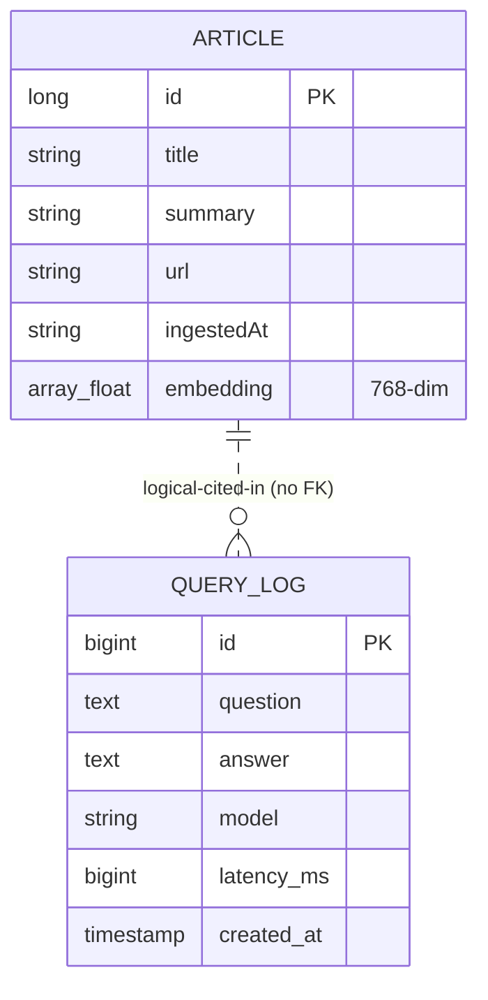

# MiniWatson — Data Model & ERD

> H2 (relational) + Parquet (columnar) + Avro (schema). 3개 데이터 표현이 한 도메인에 공존하므로 **각각 무엇을, 왜 분리했는지** 명확히 둠.

---

## 1. 데이터 표현 3종 한눈에

| 표현 | 위치 | 용도 | 수명 |
|---|---|---|---|
| **`Article` (POJO)** | `com.miniwatson.data.Article` | in-memory 도메인 객체 | 요청 단위 |
| **Avro record** | `src/main/resources/article.avsc` | Parquet 스키마 정의 | 영구 |
| **Parquet file** | `./data/articles.parquet` | knowledge base 영속화 (지식) | 영구 |
| **`QueryLog` (JPA)** | `com.miniwatson.governance.QueryLog` | audit log entity | DB 수명 |
| **H2 `query_log` 테이블** | in-mem (`dev`) / file (`demo`) | governance audit 영속화 (행동) | 프로파일별 |

요지: **"지식 데이터(Article)는 Parquet, 행동 데이터(LLM 호출 audit)는 RDB"** — watsonx.data / watsonx.governance 분리에 대응.

---

## 2. ER Diagram

```
┌──────────────────────────────────────────┐         ┌──────────────────────────────────────┐
│         Article  (Parquet)               │         │       QueryLog  (H2 query_log)       │
│         miniwatson.schema.Article        │         │       JPA @Entity                    │
├──────────────────────────────────────────┤         ├──────────────────────────────────────┤
│ PK id           long                     │         │ PK id           BIGINT IDENTITY      │
│    title        string                   │         │    question     TEXT                 │
│    summary      string                   │         │    answer       TEXT                 │
│    url          string                   │         │    model        VARCHAR              │
│    ingestedAt   string (ISO-8601)        │         │    latencyMs    BIGINT               │
│    embedding    array<float> (768)       │         │    createdAt    TIMESTAMP (@PrePersist)
└──────────────────────────────────────────┘         └──────────────────────────────────────┘
                  │                                                  ▲
                  │ (referenced indirectly:                          │
                  │  RagResult.sources contains Articles             │
                  │  whose embeddings produced the answer            │
                  │  logged in QueryLog. No FK enforced — they       │
                  │  live in different stores.)                      │
                  └─────────────────── logical link ─────────────────┘
```

**FK는 강제하지 않음**. Parquet과 H2는 물리적으로 분리. `QueryLog.question` 안의 prompt를 파싱하면 어떤 Article을 인용했는지 추론은 가능하지만, 명시적 join 키는 없음. (확장 후보: `QueryLog.sourceArticleIds VARCHAR` 또는 별도 `query_log_source` junction 테이블.)

---

## 3. Parquet / Avro 상세

### 3.1 Schema (`article.avsc`)
```json
{
  "type": "record",
  "name": "Article",
  "namespace": "miniwatson.schema",
  "fields": [
    {"name": "id",         "type": "long"},
    {"name": "title",      "type": "string"},
    {"name": "summary",    "type": "string"},
    {"name": "url",        "type": "string"},
    {"name": "ingestedAt", "type": "string"},
    {"name": "embedding",  "type": {"type": "array", "items": "float"}}
  ]
}
```

### 3.2 Why each choice
| 필드 | 타입 | 이유 |
|---|---|---|
| `id` | `long` | 우리가 부여하는 auto-increment (loadAll().size()+1) — UUID 불필요 |
| `title` | `string` | Wikipedia title 그대로 |
| `summary` | `string` | extract 본문 (수백~수천 자) — Parquet SNAPPY 압축 효과 큼 |
| `url` | `string` | 원문 페이지 링크 |
| `ingestedAt` | `string` | Avro에 native timestamp 없음 → `LocalDateTime.toString()` ISO-8601 |
| `embedding` | `array<float>` | 768-dim, columnar 저장이라 SNAPPY로 약 5–7× 압축 |

### 3.3 Storage characteristics
| Format | 1 article 평균 | 100 articles 추정 |
|---|---|---|
| JSON (legacy) | ~540 B + 768×7B embed ≈ 5.9 KB | ~590 KB |
| Parquet (SNAPPY) | ~80 B compressed | **~8 KB** (≈ 7× 더 작음) |

(README의 실측치: JSON 54KB → Parquet 7.8KB.)

### 3.4 File layout
```
./data/
├── articles.parquet         ← 본 데이터
└── .articles.parquet.crc    ← Hadoop checksum (자동 생성, git-tracked)
```
`.crc` 는 Hadoop FileSystem이 자동 생성. 손으로 만들 필요 없음.

---

## 4. H2 (governance) 상세

### 4.1 테이블 정의 (자동 생성)
JPA가 `QueryLog` 어노테이션 기반으로 다음과 동치인 DDL을 생성:

```sql
CREATE TABLE query_log (
    id         BIGINT       IDENTITY PRIMARY KEY,
    question   CLOB         NULL,      -- @Column(columnDefinition="TEXT") → H2 CLOB
    answer     CLOB         NULL,
    model      VARCHAR(255) NULL,
    latency_ms BIGINT       NULL,
    created_at TIMESTAMP    NULL
);
```

JPA naming: `latencyMs` → `latency_ms`, `createdAt` → `created_at` (Spring physical naming 기본).

### 4.2 Profile 별 동작
| Profile | datasource URL | ddl-auto | 재시작 후 데이터 |
|---|---|---|---|
| `dev` (기본) | `jdbc:h2:mem:miniwatson` | `create-drop` | **사라짐** |
| `demo` | `jdbc:h2:file:./data/miniwatson;AUTO_SERVER=TRUE` | `update` | 유지 |
| `prod` | `${DATABASE_URL}` (PostgreSQL 예상) | `validate` | 유지, 스키마 변경 금지 |

> ⚠️ `application-dev.yaml` 의 들여쓰기에 한 줄 미묘한 오타 (`hibernate:`/`ddl-auto: create-drop` 같은 라인 들여쓰기). 현재는 동작하나 PR 시 정리 권장.

### 4.3 H2 콘솔
`dev` / `demo`: `http://localhost:8080/h2-console`
- JDBC URL: 위 표의 `datasource.url`
- User: `sa`, Password: (empty)

---

## 5. Schema Evolution Plan

### 5.1 Avro/Parquet 진화 규칙
Parquet 자체는 강한 호환성을 가지나, 본 프로젝트의 `ArticleParquetStore` 는 **단일 schema** 만 알고 있음.

**진화 가능한 변경 (backward-compatible)**:
- 새 필드 추가: 기본값 (`default`) 명시.
  ```json
  {"name": "language", "type": "string", "default": "en"}
  ```
  Reader가 옛 파일 읽을 때 기본값 사용.

**진화 불가능 (큰 작업)**:
- 필드 삭제 / 타입 변경: 기존 `articles.parquet` 마이그레이션 필요.
  → 절차: (1) 새 schema 코드 배포 전 기존 데이터 backup, (2) `loadAll()` 로 메모리 적재, (3) 새 schema로 `saveAll()` 재기록.

### 5.2 H2/JPA 진화 규칙
| Profile | 동작 |
|---|---|
| dev | `create-drop` — 매번 클린, 신경 X |
| demo | `update` — JPA가 ALTER TABLE 자동. column 추가 OK, 삭제는 수동 |
| prod | `validate` — schema 불일치 시 부팅 실패. Flyway/Liquibase 도입 권장 |

prod 진입 전에 반드시 마이그레이션 도구 도입할 것 (현재 미설치).

### 5.3 Migration recipe — "Article에 language 필드 추가"
1. `article.avsc` 에 새 필드 + `default`.
2. `Article.java` 에 `private String language;` + getter/setter (Lombok).
3. `ArticleParquetStore.saveAll` / `loadAll` 매핑 추가.
4. `IngestionService.ingest()` 에서 set (Wikipedia 응답은 항상 en).
5. 빌드/실행 → 기존 `articles.parquet` 는 default값 사용해 정상 로드.
6. **다음 ingest** 가 일어나면 전체 파일 재작성 → 모든 행에 새 필드 채워짐.

---

## 6. Data Lifecycle

```
                ┌─────────────────────────────────────┐
                │  Knowledge data (Article)           │
                │                                     │
   Wikipedia ──►│  Ingestion ─► Embedding ─► Parquet  │── RAG retrieval
                │                                     │
                │  수명: 영구 (사용자가 명시적 삭제 전까지)     │
                └─────────────────────────────────────┘

                ┌─────────────────────────────────────┐
                │  Behavioral data (QueryLog)         │
                │                                     │
   User Q&A ──► │  OllamaService.ask() ─► JPA ─► H2   │── Audit dashboard
                │                                     │
                │  수명: profile에 따라 (dev=메모리,       │
                │        demo/prod=영구)               │
                └─────────────────────────────────────┘
```

**삭제 시나리오**:
- knowledge 전체 초기화: `rm ./data/articles.parquet ./data/.articles.parquet.crc`
- governance 초기화 (dev/demo): 앱 재시작 (dev) 또는 `rm ./data/miniwatson.mv.db` (demo)
- governance 부분 삭제: H2 콘솔에서 `DELETE FROM query_log WHERE …` 또는 새 endpoint 추가

---

## 7. PII / Compliance Notes

본 프로젝트는 학습용으로 다음을 가정하지 않음:
- 사용자 식별 정보 (login, IP, session) **수집 안 함**.
- `QueryLog` 는 question/answer/model/latency만 — 개인 정보 없음.
- 단, **사용자가 질문에 PII를 직접 넣으면** governance log에 남음. 운영 환경 적용 전 mask/scrub 레이어 필요.

확장 시 추가할 컬럼 (예시):
- `user_id`, `tenant_id` — multi-tenant
- `source_article_ids` — RAG citation 추적
- `flagged`, `safety_score` — content policy
- `cost_estimate` — 모델별 비용

---

## 8. ERD 다이어그램 (mermaid 호환)

GitHub/IDE에서 렌더링용:



`||..o{` 점선 = 실제 FK는 없고 의미적 참조만 있음을 표시.
